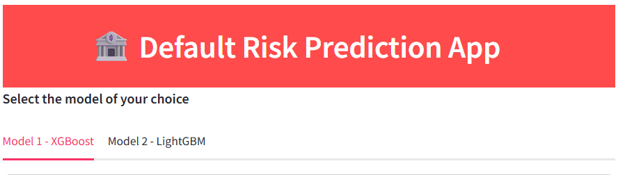

Banner [source](https://banner.godori.dev/)


[](https://share.streamlit.io/lazziemapfurira/Loan-default-prediction-app/main/streamli_app.py)
[](https://github.com/ellerbrock/open-source-badges/)
Badge [source](https://shields.io/)

# 🏦 Default Risk Prediction App

A Streamlit web application that predicts loan default risk using machine learning models (XGBoost and LightGBM) with explainable AI (SHAP) capabilities.

## App Preview

The application features a clean, user-friendly interface with multiple input sections for comprehensive risk assessment:

#
- Interactive web interface showing the prediction form with personal information, financial details, and SHAP explanation visualization*

## Key Features

- **Dual Model Architecture**: Switch between XGBoost and LightGBM models
- **50+ Predictive Features**: Comprehensive financial and behavioral inputs
- **Explainable AI**: Interactive SHAP waterfall plots
- **Real-Time Predictions**: Instant risk assessment with probability scores
- **Responsive Design**: Works on desktop and mobile devices

## Live Demo

[](https://loandefaultalternative.streamlit.app/)

## Installation

```bash
# Clone repository
git clone https://github.com/lazziemapfurira/Loan-default-prediction-app.git
cd Loan-default-prediction-app

# Install dependencies
pip install -r requirements.txt

# Launch application
streamlit run app.py


